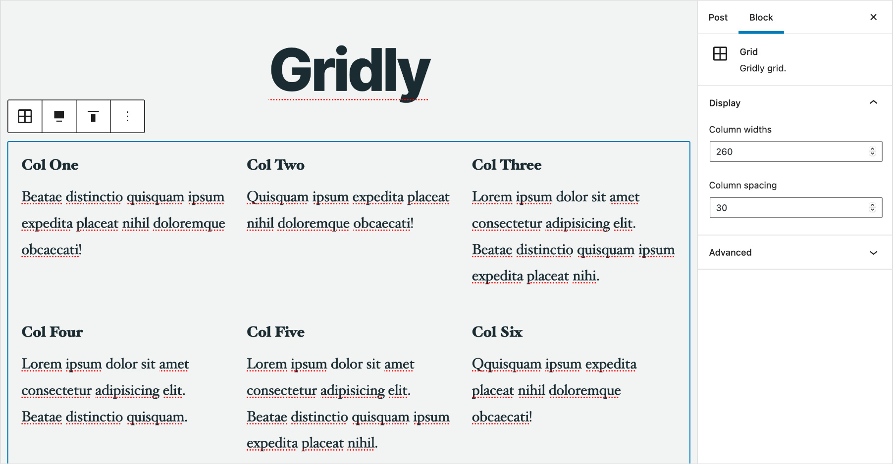

# Bloc

A few useful WordPress blocks.


## Options

A few extensions to core blocks.

### Features

- Shift: Choose to shift the block up, right, down or left.
- Padding: Add padding to any and all sides of a block.
- Max width: Limit the block to maximum width.
- Animate in: Fade in a block when it's scrolled into view.
- Visibility: Hide blocks for certain screen sizes and display blocks only for certain roles.

### Custom properties
```css
:root {
	--bloc-shift-up: -5rem;
	--bloc-shift-down: -5rem;
	--bloc-padding-sm: 1rem;
	--bloc-padding-md: 2.5rem;
	--bloc-padding-lg: 5rem;
	--bloc-max-width-sm: 30rem;
	--bloc-max-width-md: 40rem;
	--bloc-max-width-lg: 50rem;
	--bloc-animation-duration: 1s;
	--bloc-animation-distance: 1rem;
	--bloc-animation-easing: cubic-bezier(0.46, 0.03, 0.52, 0.96);
}
```


## Grid

Display content as a grid of columns or slider.

### Features

- Display an number of columns/slides.
- Choose the number to show per row at various screen sizes.
- Add/remove spacing between columns/slides.

### Custom properties
```css
:root {
	--bloc-grid-columns-gap: 2rem;
	--bloc-grid-slider-gap: 20px;
	--bloc-grid-slider-theme: currentColor;
}
```




## Slider

Display a slider.

### Features

- Choose colours and background image.
- Loop slides.
- Fade or slide between slider.
- Show pagination and navigation.


## Posts

A WordPress block for fetching posts, pages and custom post types and displaying them as a `grid`, `slider` or `accordion`.


### Features
- Fetch any posts, pages and custom post types.
- Filter by any taxonomies, terms and custom fields.
- Choose specific pages, or show all subpages for said pages.
- Order by ID, date, modified date, title, slug, menu order, random or custom field.

With postie you can fetch; fantasy books that are less than $20 sorted by price, or properties that feature waterfront views, have 3 or more bedroom and are sorted by land size.

### Templates

You can override any aspect of the display by creating templates in `my-theme-name/postie/` the basic template heirarchy is:
- `grid.php`, `slider.php` and `accordion.php` will override the main template/wrapper for those display types.
- `grid-item.php`, `slider-item.php` and `accordion-item.php` will override the template/display individual posts within those display types.
- `grid-{post-type}.php`, `slider-{post-type}.php` and `accordion-{post-type}.php` will override the default template for individual posts within those display types, for example `grid-post.php` will override `grid-item.php` for posts and `slider-page.php` would override `slider-item.php` for pages.

### Filters

```php
<?php
/**
 * Filter to modify the main query arguments.
 */
add_filter('postie/query', function(array $args) {
    return array_merge($args, ['author_name' => 'admin']);
});

/**
 * Filter to set the no results i.e empty message.
 */
add_filter('postie/empty', function(string $message, string $display) {
    return __('Sorry, there were no matching results.');
}, 10, 2);
```

### Custom properties

Postie comes with little to no actually styling just what's need for the base layout, below are the available custom properties.

```css
:root {
	--bloc-posts-grid-gap: 2rem;
	--bloc-posts-slider-gap: 20px;
	--bloc-posts-slider-speed: 250;
	--bloc-posts-slider-theme: coral;
	--bloc-posts-accordion-gap: 1.5rem;
	--bloc-posts-accordion-speed: 0.5s;
	--bloc-posts-accordion-easing: cubic-bezier(0.46, 0.03, 0.52, 0.96);
}
```
Note: slider-gap must be set in pixels.


## Todo

### Common
- Switch from FormToken to React Select.
- Need to use a select store instead of get apiFetch so requests are cached.

### Grid
- Slider mode.
- Example not rendering in columns.
- Add link to grid columns.

### Posts
- Ajax pagination and load more.

### Slider
- Everything.
- Slide background images and links.
