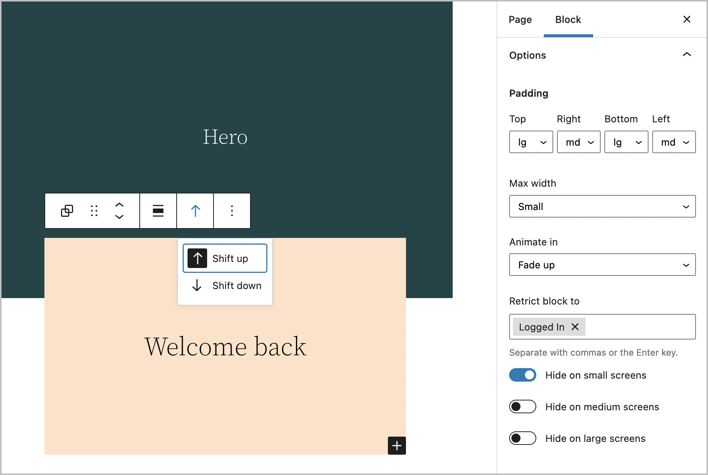
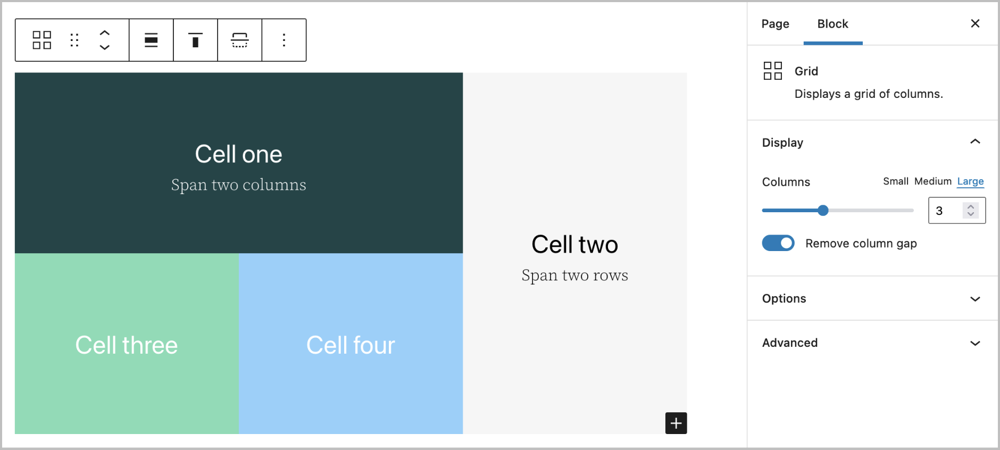
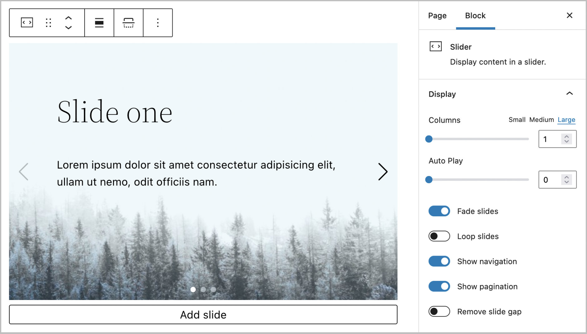
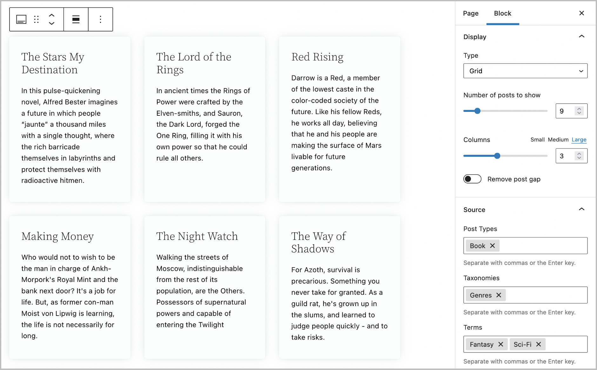

# Bloc

A few useful WordPress blocks and block options.

`composer require lambry/bloc`

## Options

Extensions to core blocks for a little extra functionality.

### Features

- Shift: Choose to shift the block up or down.
- Padding: Add padding to any and all sides of a block.
- Max width: Limit the block to maximum width.
- Animate in: Fade in a block when it's scrolled into view.
- Retrict to: Only show blocks for certain user roles.
- Visibility: Hide blocks for certain screen sizes.

<div style="max-width: 750px">



</div>

### Custom properties

```css
:root {
	--bloc-shift-up: -5rem;
	--bloc-shift-down: -5rem;
	--bloc-padding-sm: 1rem;
	--bloc-padding-md: 2.5rem;
	--bloc-padding-lg: 5rem;
	--bloc-max-width-sm: 30rem;
	--bloc-max-width-md: 40rem;
	--bloc-max-width-lg: 50rem;
	--bloc-animation-duration: 1s;
	--bloc-animation-distance: 1rem;
	--bloc-animation-easing: cubic-bezier(0.46, 0.03, 0.52, 0.96);
}
```

## Grid

Block to display content in a grid of rows and columns.

### Features

- Display any number of items.
- Choose the number columns to show at different screen sizes.
- Add or remove spacing between columns.
- Choose the number of columns and rows any individual cell should span.

<div style="max-width: 750px">



</div>

### Custom properties

```css
:root {
	--bloc-grid-gap: 2rem;
}
```

## Slider

Block to display content in a slider, or carousel (i.e. a slider with multiple slides shown at once).

### Features

- Display any number of slides.
- Choose the number slides to show a once at different screen sizes.
- Optionally add a background image to each slide.
- Optionally link the entire slide.
- Choose between slide and fade effects.
- Loop slides for an inifitnte slider.
- Show or hide the navigation arrows.
- Show or hide the pagination i.e. bullets.
- Add or remove spacing between slides.

<div style="max-width: 750px">



</div>

### Custom properties

```css
:root {
	--bloc-slider-gap: 2rem;
	--bloc-slider-speed: 250ms;
	--bloc-slider-theme: currentColor;
}
```

## Posts

Block for fetching posts, pages and custom post types and displaying them in a `grid`, `slider` or `accordion`.

### Features
- Fetch any posts, pages or custom post types.
- Filter by any taxonomies, terms and custom fields.
- Optionally offset posts or include sticky posts.
- Choose specific pages, or show all subpages for said pages.
- Order by ID, published date, modified date, title, slug, menu order, random or even a custom field.
- Choose the number of results to display per row at different screen sizes, as well the total number of results to show.
- Slider only options include: autoplay, loop, navigation and pagination.
- Accordion only options include: open first item and open one at a time.

With the posts block you could choose to show all fantasy books sorted by price that are less than $20, or properties that feature waterfront views, have 3 or more bedroom and are sorted by land size.

<div style="max-width: 750px">



</div>

### Templates

You can override any aspect of the display by adding template files in a folder called `bloc/posts/`, the basic template heirarchy is:
- `grid.php`, `slider.php` and `accordion.php` will override the main template/wrapper for those display types.
- `grid-item.php`, `slider-item.php` and `accordion-item.php` will override the template/display for individual posts within those display types.
- `grid-item-{post-type}.php`, `slider-item-{post-type}.php` and `accordion-item-{post-type}.php` will override the template by post type, for example `grid-item-post.php` will override `grid-item.php` for posts and `slider-item-page.php` would override `slider-item.php` for pages.

### Custom properties

```css
:root {
	--bloc-posts-gap: 2rem;
	--bloc-posts-slider-speed: 500ms;
	--bloc-posts-slider-theme: currentColor;
	--bloc-posts-accordion-easing: cubic-bezier(0.46, 0.03, 0.52, 0.96);
	--bloc-posts-accordion-duration: 250ms;
}
```

### Filters

```php
<?php
// Filter to modify the main posts query arguments.
add_filter('postie/query', fn(array $args) => array_merge($args, ['author_name' => 'admin']));

// Filter to set the no results i.e empty message.
add_filter('postie/empty', function(string $message, string $display) {
    return __('Sorry, there were no matching results.');
}, 10, 2);
```
